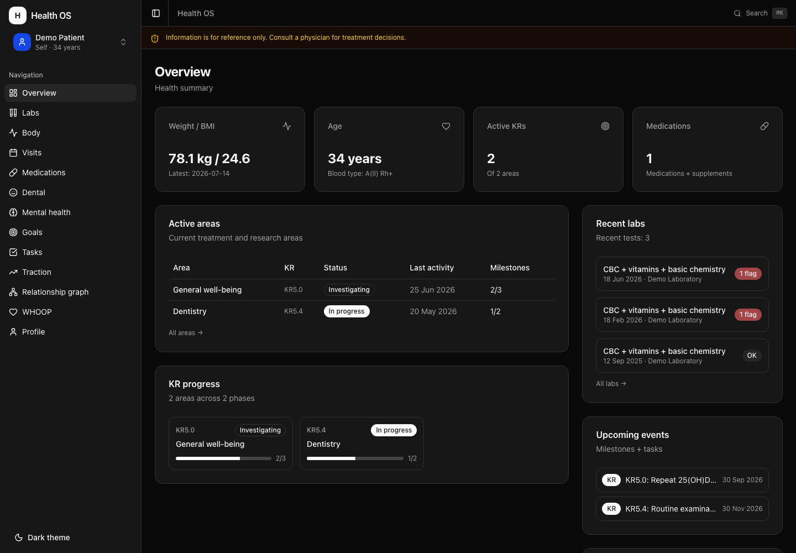
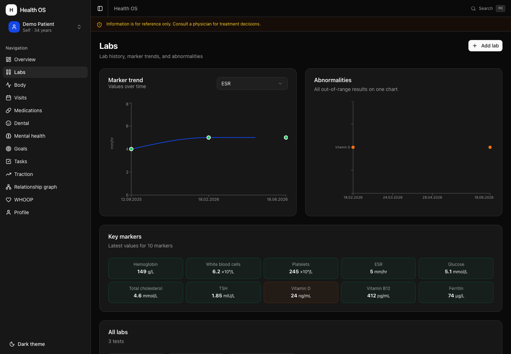

# Health-OS

Персональная система управления здоровьем на базе Claude Code. Медкарта, анализы, визиты, лекарства и цели живут локальными файлами, а разбираются консилиумом AI-специалистов, который умеет спорить сам с собой.



<p align="center"><sub>Дашборд на демо-наборе. Все данные вымышлены — реальных сведений о здоровье на снимке нет.</sub></p>

---

> ## ⚠️ Прочитайте до установки
>
> **Это не медицинское изделие.** Программа не зарегистрирована, не сертифицирована и не проходила клинических испытаний. Она не диагностирует, не лечит и не предотвращает заболевания.
>
> **Это не медицинская рекомендация.** Система построена на языковой модели. Модели ошибаются, уверенно излагают неверное и не видят вашего клинического контекста. Любое решение о диагностике и терапии принимает врач.
>
> **Некоммерческий проект.** Распространяется бесплатно по лицензии MIT, разрабатывается добровольно, не связан с оказанием медицинских услуг, не содержит рекламы и не монетизируется.
>
> **Предоставляется «как есть», без гарантий.** Вы используете программу **исключительно на собственный риск**. Авторы не несут ответственности за вред здоровью, ошибочные выводы, утрату или разглашение данных.
>
> **Все демонстрационные данные вымышлены.** Демо-набор описывает несуществующего человека. Совпадения случайны.
>
> **За свои данные отвечаете вы.** У проекта нет серверной части, авторы не имеют доступа к вашим файлам. Но и защита этих файлов — шифрование диска, резервные копии, ограничение доступа, соблюдение законодательства вашей юрисдикции — целиком на вас.
>
> **Данные уходят в API языковой модели.** Иначе система не смогла бы их анализировать. Это основной канал выхода данных за пределы устройства — условия обработки определяет поставщик модели, а не этот проект.
>
> Полные условия — **[DISCLAIMER.md](DISCLAIMER.md)**. Установка означает согласие с ними.
>
> 🚨 **При признаках неотложного состояния обращайтесь в скорую помощь.** Программа не является системой мониторинга и не способна вызвать помощь.

---

## Зачем это нужно

Медицинские данные человека размазаны по десятку мест: PDF из лаборатории, бумажка от врача, приложение фитнес-браслета, память. При этом медицина устроена так, что каждый специалист смотрит в свою зону — и причина симптома регулярно оказывается за её границей.

Health-OS решает две задачи:

1. **Собрать всё в одном месте** в структурированном виде, чтобы данные пятилетней давности можно было сопоставить со вчерашними.
2. **Заставить систему рассуждать холистически** — искать первопричину, а не описывать отклонения, и учитывать образ жизни и среду наравне с анализами.

---

## Что внутри

### 15 AI-специалистов

Кардиолог, гематолог, эндокринолог, невролог, гастроэнтеролог, уролог, гинеколог, педиатр, дерматолог, ЛОР, ортопед, психиатр, стоматолог, офтальмолог и health-коуч. Каждый — отдельный агент со своей клинической зоной, работающий в изолированном контексте.

Ключевой принцип: **в промпте специалиста нет ни одного факта о пациенте.** Клиническую картину он строит сам, читая данные. Промпт — это методология, а не медкарта, иначе он неизбежно устаревает и начинает утверждать то, что уже опровергнуто анализами.

### Консилиум с настоящим спором

Параллельный запуск специалистов сам по себе консилиумом не является — это набор монологов, где слабая гипотеза выглядит так же убедительно, как сильная. Здесь три раунда:

| Раунд | Что происходит |
|-------|----------------|
| **1** | Независимые заключения **вслепую** — специалисты не видят выводов друг друга, иначе якорятся на первом озвученном |
| **2** | Перекрёстная критика: те, чьи зоны пересеклись, обязаны оспорить коллег по существу |
| **3** | Разрешение споров по уровню доказательности и синтез общей первопричины |

**Искусственный консенсус запрещён.** Неразрешённое разногласие попадает в отчёт с обеими позициями — именно оно точно указывает, какое обследование нужно следующим. Сглаженная формулировка эту информацию уничтожает.

### Учёт пола

Пол определяет, какие состояния вероятны, какой скрининг показан по возрасту и как читаются одни и те же цифры. В профиле три независимых поля: `sex` для медицинских выводов, `gender_identity` для обращения к человеку, `hormone_therapy` для поправки на терапию. Смешивать их нельзя ни в одну сторону.

Показательный пример — снижающийся ферритин. У женщины детородного возраста это прежде всего вопрос о менструальной кровопотере, у мужчины — показание к эндоскопии. Одни и те же цифры, разный первый шаг обследования. Без поля пола система выбрала бы неверное направление поиска и не сообщила бы об этом.

Если пол не указан, специалист прямо говорит, какие выводы недоступны, — а не предполагает молча.

### Профили членов семьи

Одна установка ведёт медкарты нескольких человек: владельца, супруга, детей,
пожилых родителей. Каждый профиль изолирован — данные одного человека не
используются при разборе другого. Единственный канал наследственности —
поле `family_history` в профиле самого пациента, заполняемое сознательно,
а не автоматическим чтением чужих карт.

Активный профиль **один на систему**: тот же указатель читают дашборд и
Claude Code. Разойтись и показывать данные разных людей они не могут.

Работа не с тем профилем — самая дорогая ошибка этой подсистемы, поэтому
текущий человек всегда виден в шапке дашборда, объявляется первой строкой
в `/day`, а проверка целостности отклоняет данные, записанные мимо профиля.

**Детский профиль включает педиатрический контур.** Взрослые референсы к
детским анализам не применяются: у растущего ребёнка щелочная фосфатаза
кратно выше взрослой нормы и это норма, до 4–5 лет в лейкоформуле
физиологически преобладают лимфоциты, а рост и вес читаются перцентилем по
возрасту, а не абсолютным значением. Специалист, применивший взрослый
интервал, выдал бы патологию там, где её нет. Педиатр ведёт детский случай
и рецензирует заключения остальных.

Профиль другого взрослого заводится с его ведома — см. раздел о данных
третьих лиц в [DISCLAIMER.md](DISCLAIMER.md).

### Граф связей

JSON-файлы хранят значения: маркеры, даты, дозировки. Они точны, но между
собой не связаны. Wiki-слой хранит **связи и суждения** — почему маркер
важен, какая гипотеза его объясняет, кто из врачей что сказал.

Метод — [LLM Wiki Андрея Карпаты](https://gist.github.com/karpathy/442a6bf555914893e9891c11519de94f),
адаптированный под медкарту. Ключевое отличие: **числа на страницы не
переносятся.** У Карпаты источники неструктурированы, поэтому markdown —
шаг вперёд. Здесь значения уже лежат в JSON, на них построены тренды и
проверки. Страница ссылается на запись, а не копирует её: копия неизбежно
разъезжается с оригиналом.

Практическая ценность не в картинке, а в трёх проверках, которые человек
делать устаёт, а агент — нет:

| Проверка | Что находит в медкарте |
|----------|------------------------|
| **Противоречия** | Кардиолог сказал одно, невролог другое. Гипотеза утверждает «маркер стабилен», свежий анализ показывает падение |
| **Сиротки** | Анализ загружен и никем не интерпретирован. Гипотеза без следующего шага. Назначение врача, о котором забыли |
| **Битые ссылки** | Препарат назван в протоколе визита и отсутствует в списке лекарств |

Противоречие не разрешается автоматически: показываются обе позиции и то,
что их рассудит. Расхождение между источниками — это и есть находка.

### Холистическая рамка

Обязательна для всех специалистов. Не декларация «мыслите шире», а конкретная машинерия:

- **Каузальная лестница** из пяти уровней: сигнал → орган → регуляция → первопричина → контекст жизни. Остановка на втором уровне считается незавершённым анализом
- **13 сквозных осей** (вегетативная, ГГН, тиреоидная, воспаление, циркадные ритмы, оксигенация и другие) с указанием, какие специальности каждая пересекает
- **Матрица контекста жизни**: география, климат, жильё, работа, питание, сон, движение, вещества, соцсреда
- **Правило приоритета**: модифицируемый бытовой фактор проверяется раньше редкой патологии

Методологическая основа — биопсихосоциальная модель Энгеля, аллостатическая нагрузка, парадигма экспосома. Это системная медицина, а не альтернативная.

### Доказательная база

Каждое содержательное утверждение маркируется уровнем **A/B/C/D/⚠️**. Приоритет международных источников: Cochrane, PubMed, NICE, USPSTF, WHO, руководства профильных обществ.

Отдельное жёсткое правило — **ссылки подтверждаются, а не выдумываются.** У специалистов есть узкий канал в сеть, ограниченный белым списком доменов, ради одной задачи: проверить, что цитируемое руководство существует и говорит именно то, что ему приписывают. Конкретика — DOI, автор, номер руководства — допустима только с открываемым URL, страницу по которому агент открыл. Без URL остаётся прежний режим: орган и тема, без конкретики.

**Данные пациента в поисковый запрос не попадают.** Запрос формулируется как вопрос о литературе, обезличенно, и показывается вам до отправки. Каждый запрос пишется в журнал — иначе утверждение о приватности непроверяемо. Подробнее — `.claude/shared/source-verification.md`.

### Реагирование на критическое

Пороги неотложных состояний, при которых обычный workflow останавливается: panic values по лабораторным маркерам, гипертонический криз, красные флаги психического состояния с немедленным выводом контактов экстренной помощи.

### 24 скилла и дашборд

Скиллы покрывают весь цикл: приём документов, расшифровка анализов, визиты, лекарства, зубы, прививки, метрики тела, настроение, цели, поиск врача и анализов. Дашборд на Next.js показывает тренды и карточки. Преимущественно на чтение, но часть роутов умеет писать в `Data/` — путь резолвится через `resolveWithin()`, ввод валидируется. Привязан к `127.0.0.1`, CSRF-защиты нет: см. `docs/SECURITY.md`.



<p align="center"><sub>Раздел анализов на демо-данных: тренд маркера, отклонения, ключевые показатели.</sub></p>

---

## Приватность

Проект спроектирован из предположения, что **медданные не должны покидать устройство**.

| Механизм | Как работает |
|----------|--------------|
| Локальный git | Репозиторий без remote. Пушить некуда по построению |
| Инвертированный `.gitignore` | Игнорируется всё содержимое `Data/`, исключения перечислены поимённо. Ошибка приводит к тому, что файл не попадёт в git, а не к утечке |
| Оригиналы вне контроля версий | PDF и сканы содержат PHI в сыром виде и переживают в истории любое удаление |
| Дашборд только на loopback | `127.0.0.1`, без доступа из локальной сети. Часть роутов пишет в `Data/`, поэтому привязка к loopback — основная защита |
| Промпты без PII | Ни один агент не содержит данных пациента |
| Изоляция профилей | Данные одного члена семьи не читаются при разборе другого; проверка целостности отклоняет записи мимо профиля |
| Поиск без данных пациента | Запрос к сети — обезличенный вопрос о литературе, показывается до отправки и пишется в журнал |

Подробнее — [docs/SECURITY.md](docs/SECURITY.md).

---

## Быстрый старт

### Сначала — посмотреть на демо-данных

Прежде чем вносить своё, разверните набор вымышленного пациента и осмотритесь:

```bash
git clone <репозиторий> health-os && cd health-os
./setup.sh --demo
cd Dashboard && npm install && npm run dev
```

Дашборд откроется на `http://127.0.0.1:3000`.

### Затем — своя установка

Демо и рабочий режим **не смешиваются**: перед переходом очистите `Data/`, иначе индексы разойдутся с файлами. Команда очистки — в [INSTALL.md](INSTALL.md).

```bash
./setup.sh
```

Затем откройте проект в Claude Code и запустите:

```
/onboarding
```

Скилл проведёт discovery-интервью и соберёт стартовую медкарту.

Подробная установка — [INSTALL.md](INSTALL.md). Пошаговый онбординг — [docs/ONBOARDING.md](docs/ONBOARDING.md).

---

## Требования

- **macOS или Linux.** На Windows — через WSL2: установка и хуки написаны на bash
- [Claude Code](https://claude.com/claude-code)
- Python 3.10+ — для скрипта проверки целостности
- `jq` — для хуков сессий
- Node.js 20+ и npm — только для дашборда, система работает и без него

Опционально: MCP-серверы для WHOOP, Todoist и Google Calendar.

---

## Документация

| Файл | О чём |
|------|-------|
| **[DISCLAIMER.md](DISCLAIMER.md)** | **Условия использования и отказ от ответственности — прочитать первым** |
| [INSTALL.md](INSTALL.md) | Установка по шагам |
| [docs/ONBOARDING.md](docs/ONBOARDING.md) | Первые дни работы с системой |
| [docs/ARCHITECTURE.md](docs/ARCHITECTURE.md) | Как устроено внутри |
| [docs/SECURITY.md](docs/SECURITY.md) | Модель угроз и правила |
| [CLAUDE.md](CLAUDE.md) | Инструкции для Claude Code |
| [.claude/shared/](.claude/shared/) | Рамки рассуждения и схемы данных |

---

## Ограничения, о которых стоит знать заранее

- **Система не заменяет врача** и не предназначена для самодиагностики
- **Доступ в сеть узкий и односторонний** — специалисты могут подтвердить источник по белому списку доменов (Cochrane, PubMed, NICE, USPSTF, WHO), но не ищут свободно. Данные пациента в запросы не попадают
- **Качество выводов зависит от полноты данных.** Пустая медкарта даст пустой анализ
- **Проект ориентирован на российский контекст** в части ОМС, лабораторий и маршрутизации, но клиническая часть универсальна
- **Это персональный инструмент**, а не медицинская информационная система: нет многопользовательского режима, аудита доступа и сертификации

---

## Лицензия

MIT — см. [LICENSE](LICENSE).

Лицензия распространяется на код и промпты. Ваши медицинские данные принадлежат вам и остаются на вашем устройстве.

---

⚕️ Информация, которую выдаёт система, носит справочный характер. Для принятия решений о лечении обратитесь к врачу. При признаках неотложного состояния звоните в скорую помощь.
