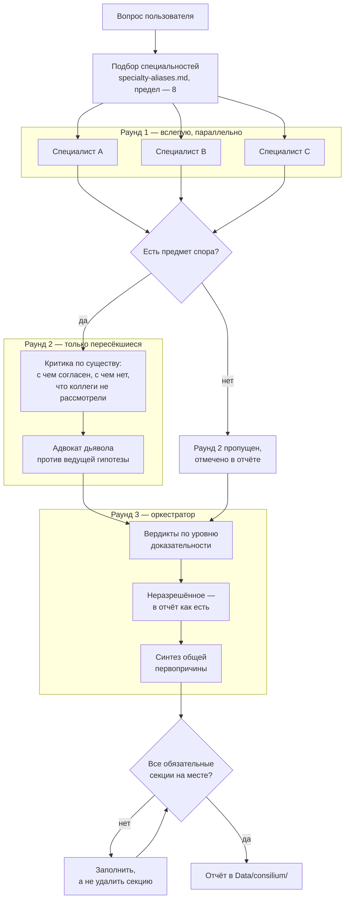
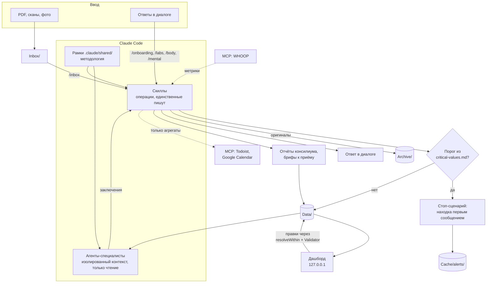

# Архитектура

> ⚠️ **Не медицинское изделие. Не медицинская рекомендация. Некоммерческий проект.**
> Предоставляется «как есть», без гарантий. Использование — на собственный риск.
> Все демо-данные вымышлены. Полные условия — [DISCLAIMER.md](../DISCLAIMER.md) (в корне репозитория).
> 🚨 При неотложном состоянии — скорая помощь.

Как система устроена внутри и почему именно так. Документ для тех, кто собирается её дорабатывать: добавлять специалистов, менять скиллы, разбираться, почему что-то работает не так, как ожидалось.

---

## Блок 1. Общая картина

Health-OS собран из четырёх сущностей, и все они — обычные файлы.

| Сущность | Чем является | Роль |
|----------|--------------|------|
| **Данные** | JSON, CSV, JSONL, Markdown в `Data/` | База данных |
| **Claude Code** | CLI-агент | Движок: читает, пишет, рассуждает |
| **Скиллы** | Markdown в `.claude/skills/*/SKILL.md` | Операции над данными |
| **Агенты** | Markdown в `.claude/agents/*.md` | Специалисты с изолированным контекстом |

Ни базы данных, ни сервера, ни ORM. Файловое дерево и текстовые инструкции.

### Почему файлы, а не база

Три причины, и все практические.

**Данные переживают систему.** JSON с результатами анализов читается любым инструментом и через десять лет, когда от этого проекта не останется ничего. База требует своей версии движка, своей схемы, своей миграции. Медицинская история человека живёт дольше любого софта, и формат хранения должен это учитывать.

**Diff и история бесплатны.** Локальный git даёт версионирование, откат и понятную историю правок без единой строки кода. Видно, когда маркер изменился, кто это записал и что было до.

**Движок читает файлы напрямую.** Claude Code работает с файловой системой как с первичным интерфейсом. База данных добавила бы слой, который пришлось бы описывать в промптах, — и этот слой стал бы ещё одним местом рассинхронизации.

Цена решения честная: нет транзакций, нет ограничений целостности на уровне хранилища, нет конкурентного доступа. Вместо них — инварианты, описанные в `.claude/shared/data-schemas.md`, и проверки, которые скиллы выполняют перед записью. Это слабее, чем СУБД, и об этом надо помнить.

### Скиллы и агенты — разные вещи

Их легко перепутать, но роли противоположные.

**Скилл** — это операция. Он знает, где что лежит, в каком порядке спрашивать, что проверить перед записью и что обновить после. Скиллы пишут данные.

**Агент** — это точка зрения. Он ничего не знает о структуре проекта сверх того, что написано в контракте, и никогда ничего не пишет: только читает `Data/` и возвращает рассуждение. Изолированный контекст здесь не техническая деталь, а суть — двенадцать специалистов, рассуждающих в одном контексте, дают одно мнение в двенадцати формулировках.

---

## Блок 2. Слои

```
Данные Data/
   ↓ читаются
Рамки .claude/shared/ — как рассуждать над данными
   ↓ обязательны для
Агенты .claude/agents/ — клинические зоны, только чтение
   ↓ вызываются из
Скиллы .claude/skills/ — операции, единственные, кто пишет
   ↓ результат виден в
Дашборд Dashboard/ — визуализация, только 127.0.0.1
```

Направление зависимостей одностороннее: нижние слои не знают о верхних. Агент не знает, из какого скилла его вызвали. Рамка не знает, какой агент её читает. Данные не знают ни о чём.

Это даёт главное свойство системы: **добавление специалиста не требует правок нигде, кроме реестров.** Новый агент получает всю методологию из рамок, а данные — из `Data/`.

---

## Блок 3. Слой данных

```
Data/
├── profile.json            медкарта: рост, аллергии, хронические, семейный анамнез,
│                           блок lifestyle — питание, вещества, сон, тренировки
├── context/                среда: география, климат, жильё, работа, соцокружение
├── history.json            операции, госпитализации, перенесённые заболевания
├── hypotheses.json         гипотезы о первопричинах со статусом и доказательной базой
├── vaccinations.json       прививки и туберкулиновые пробы
├── body-metrics.csv        вес, давление, ИМТ, состав тела — append-only
├── labs/                   анализы + _index.json + _marker-aliases.json
├── doctors/                contacts.json, visits/ с индексом, prep/ — брифы к приёму
├── dental/                 карта зубов по ISO 3950, процедуры
├── medications/            current.json: лекарства, БАДы, наружное, протоколы
├── mental/                 journal.jsonl — настроение, энергия, стресс, сон
├── costs/                  расходы, append-only JSONL
├── goals/                  цели с направлениями, milestone и оценкой стоимости
├── consilium/              отчёты консилиумов + _sessions.json
├── traction/               история обзоров прогресса
└── specialists/            marker-ownership.json, cross-specialty-map.json
```

Полное описание каждого файла — `.claude/shared/data-schemas.md`. Этот документ объявлен единственным источником истины по структуре, и правило жёсткое: **скилл ссылается на него, а не переписывает схему у себя.**

Правило появилось не из любви к порядку. Раньше каждый скилл держал собственную копию схемы, копии разошлись, и скилл, добросовестно следовавший своей документации, не находил данные при чтении и создавал несовместимый файл при записи.

### Индексы

`Data/labs/_index.json` и `Data/doctors/visits/_index.json` — точки входа в свои коллекции. Агент не сканирует каталог и не угадывает имена файлов: он читает индекс, отбирает релевантные записи по полям `type`, `flags`, `specialty`, `brief` и читает только отобранное.

Инвариант: число записей в индексе равно числу файлов в каталоге. Проверяется командами из блока «Инварианты» в `data-schemas.md`.

### Два реестра специалистов

`Data/specialists/marker-ownership.json` — кто ведущий по каждому маркеру. Нужен, чтобы гематолог и эндокринолог не выдавали два конкурирующих основных вывода по ТТГ: у маркера есть `owner`, остальные комментируют, но не дублируют.

`Data/specialists/cross-specialty-map.json` — перекрёстные паттерны, сформулированные **как условия, а не как утверждения о пациенте**. У каждого паттерна есть `trigger_conditions[]` и `min_conditions`: агент проверяет каждое условие по актуальным данным и активирует паттерн только при фактическом совпадении. Прежняя версия файла хранила конкретные значения пациента, устарела и заставляла агентов утверждать уже опровергнутое.

---

## Блок 4. Слой рамок

Семь документов в `.claude/shared/`. Это методология, вынесенная из промптов, чтобы существовать в одном экземпляре.

| Документ | Что задаёт | Кто обязан читать |
|----------|-----------|-------------------|
| `holistic-framework.md` | Способ рассуждения: каузальная лестница из пяти уровней, 13 сквозных физиологических осей, матрица контекста жизни, хронологический якорь, терапевтический порядок, антипаттерны | Все агенты, аналитические скиллы |
| `specialist-contract.md` | Общий контракт: обязательное чтение, процедура отбора анализов, разрешение конфликтов источников, обязательные секции заключения | Все агенты |
| `evidence-base.md` | Иерархия источников, уровни A/B/C/D/⚠️, формат ссылки, запрет на выдуманные ссылки | Все агенты, аналитические скиллы |
| `critical-values.md` | Пороги неотложных состояний, порядок действий при их обнаружении, красные флаги психического состояния | `/labs`, `/inbox`, `/body`, `/mental`, все агенты |
| `consilium-protocol.md` | Три раунда, правила критики, правила вердикта, запрет искусственного консенсуса | `/consilium` и участвующие агенты |
| `data-schemas.md` | Структура всех файлов `Data/`, инварианты, правила записи | Все пишущие скиллы |
| `specialty-aliases.md` | Разговорные названия → имена агентов, автоподбор специальностей по теме вопроса | `/consilium`, `/doctor-consult` |

Вынос сделан по той же причине, что и единый источник схем: `specialist-contract.md` собран из двенадцати файлов агентов, где одни и те же правила дублировались дословно и успели разойтись между собой.

---

## Блок 5. Почему в промптах агентов нет фактов о пациенте

Это центральное архитектурное правило системы, и оно стоит подробного объяснения.

Соблазн очевиден: записать в промпт кардиолога «у пациента синусовая тахикардия и повышенные триглицериды» — и агент сразу в курсе, не тратит токены на чтение, отвечает быстрее и точнее.

Проблема в том, что **у промпта и у данных разные скорости обновления**.

Данные обновляются сами собой: пришли новые анализы — `/inbox` разобрал их и записал. Файл теперь говорит другое. Это происходит регулярно и не требует ничьего внимания.

Промпт правится вручную. Его надо вспомнить, открыть, найти нужную строку, понять, что она устарела, исправить. Ни одно из этих действий не происходит автоматически, и ни одно не напоминает о себе.

Через несколько итераций возникает расхождение. И здесь принципиальный момент: **при расхождении промпт проигрывает, но агент об этом не знает.** Он не видит противоречия, потому что содержимое промпта воспринимается им не как утверждение, требующее проверки, а как данность. Он строит рассуждение на устаревшем факте с полной уверенностью и выдаёт результат, неотличимый по форме от корректного.

В рабочей версии системы это происходило буквально: промпты агентов утверждали полицитемию, нарастающий лимфоцитоз и повышенные триглицериды, тогда как свежие анализы опровергали все три. Агенты продолжали строить на них выводы — уверенно, структурированно, с уровнями доказательности.

Отсюда правило в трёх частях:

1. **Промпт специалиста — это методология, а не медкарта.** Клиническую зону, маркеры и способ рассуждения он описывает. Состояние пациента — нет.
2. **Клиническая картина строится агентом самостоятельно, чтением `Data/`.** Каждый раз заново.
3. **Если агенту кажется, что он «уже знает» что-то о пациенте, не прочитав это в `Data/`, — он это выдумал.** Формулировка вынесена в контракт дословно.

Правило распространяется дальше промптов. `cross-specialty-map.json` хранит условия вместо значений по той же причине. Возраст вычисляется из даты рождения, а не записывается числом. Давность исследования — из его даты и текущей, а не из фразы «полгода назад».

### Следствие: производные документы не источник истины

Отчёты консилиумов, брифы к приёму, записи гипотез — снимки рассуждения на момент написания. Они не обновляются при поступлении новых данных и вполне могут опираться на то, что опровергнуто через неделю.

Правило: прежде чем сослаться на вывод из производного документа, сверьте его основания с актуальными данными. Если основание снято — вывод недействителен, и об этом надо сказать прямо, указав документ и дату.

`/consilium` делает это системно: перед синтезом он перечитывает прошлые отчёты и выносит недействительные выводы в отдельную секцию нового отчёта. Старые отчёты при этом не редактируются — они остаются историческим снимком.

---

## Блок 6. Приоритет источников при конфликте

Источники противоречат друг другу регулярно. Порядок строгий:

```
файл анализа  >  hypotheses.json  >  profile.json  >  визиты  >  промпт
```

Сопутствующие правила, каждое со своей причиной:

**Референсный интервал берётся из самого файла анализа.** Поля `reference_min` / `reference_max` привязаны к лаборатории и методу. Нормы «по памяти» запрещены: одно и то же значение бывает `normal` в одной лаборатории и `high` в другой. Практическое следствие — узкий референс одной лаборатории создаёт видимость отклонения там, где по референсу другой всё нормально.

**Единицы сверяются до любого сравнения.** Один маркер приходит из разных лабораторий в разных единицах. Словарь `Data/labs/_marker-aliases.json` хранит канонические имена, синонимы, коэффициенты пересчёта и — отдельным полем `not_synonyms` — аналиты, которые похожи по названию, но являются разными веществами и в один тренд объединяться не должны.

Пример из словаря: тестостерон записан и в нг/мл, и в нмоль/л. Без пересчёта тренд «17.33 → 6.5» читается как обвал втрое, тогда как на деле это рост.

**Значения из разных лабораторий сравниваются по положению в референсе**, а не по абсолютному числу. Исключение — маркеры, для которых руководства задают абсолютный целевой уровень, а не популяционный референс. Применяя исключение, агент обязан назвать его явно.

**Данные старше 24 месяцев** помечаются как требующие подтверждения. Вывод, целиком опирающийся на них, маркируется соответственно.

**Если `hypotheses.json` противоречит анализу — верны данные.** Опровержение гипотезы так же ценно, как подтверждение, и должно быть названо прямо.

**Расхождение называется явно.** Молча выбрать удобный источник запрещено: нужно показать конфликт и объяснить выбор.

---

## Блок 7. Три поколения схемы анализов

Файлы в `Data/labs/` существуют в трёх формах одновременно. Это факт данных, а не дефект, и знать о нём обязательно.

| Поколение | Форма | Откуда взялось |
|-----------|-------|----------------|
| **v1** | Плоский массив `markers[]` | Исходная схема, ей записана основная часть исторических анализов |
| **v2** | `panels[].markers[]` | Появилась, когда лаборатории начали отдавать результаты панелями |
| **v3** | `studies[].markers[]` | Документы, где результаты сгруппированы по исследованиям с разным материалом и разными исполнителями |

Отдельно стоит схема InBody (`type: "body_composition"`) — у неё вообще нет маркеров в обычном смысле, только блоки состава тела.

### Главная ловушка

**Поле `version` не различает схемы.** У всех трёх поколений оно равно `1`. Отличать их надо по наличию ключа: `markers`, `panels` или `studies`.

Отсюда обязательное правило чтения — маркеры собираются объединением всех трёх источников:

```
markers[]  +  panels[].markers[]  +  studies[].markers[]
```

```bash
jq '[(.markers // []),
     ([(.panels // [])[].markers // []] | add // []),
     ([(.studies // [])[].markers // []] | add // [])] | add' file.json
```

Цена ошибки асимметрична и потому опасна. Чтение только `panels[].markers[]` теряет почти всю историю — код при этом работает, ничего не падает, тренды строятся, просто они построены на нескольких последних точках. Чтение только `markers[]` теряет все свежие результаты — и тоже без единой ошибки в логе.

Именно поэтому правило вынесено в `data-schemas.md` как обязательное, а в дашборде реализовано отдельной функцией `collectMarkers`, а не повторяется в каждом месте чтения.

### Почему старые файлы не мигрировали

Миграция выглядит очевидным решением: привести всё к одной схеме и забыть. Против неё два аргумента.

Первый: v3 существует не от небрежности. Урологическое обследование с четырьмя разными материалами и тремя исполнителями естественно ложится в `studies[]` и плохо — в плоский список. Приведение к общей схеме потеряло бы структуру документа.

Второй, более весомый: миграция — это массовая перезапись медицинских данных скриптом. Ошибка в нём тихо испортит историю анализов, и обнаружится это через год, когда кто-то заметит странный тренд. Риск несопоставим с выигрышем в удобстве чтения.

Канон для новых записей — v2. Существующие файлы не трогаются.

---

## Блок 8. Консилиум

Центральный механизм системы и то, ради чего построено всё остальное.

Параллельный запуск специалистов сам по себе консилиумом не является. Двенадцать независимых монологов, сшитых оркестратором, дают набор мнений: никто ничего не проверил, никто ни с кем не спорил, и слабая гипотеза выглядит ровно так же убедительно, как сильная.



### Почему первый раунд слепой

Специалисты не видят выводов друг друга. Это не оптимизация, а защита от якорения: увидев чужой вывод до того, как сформировал свой, специалист перестаёт искать собственный и начинает объяснять чужой.

Независимость первого раунда — источник разнообразия гипотез. Без неё во втором раунде не о чем будет спорить: все уже согласны с тем, кто высказался первым.

Дополнительное требование раунда: минимум две конкурирующие гипотезы от каждого участника с указанием, что их различает. Одна гипотеза — это догадка, а не анализ.

И секция «Уверенность и уязвимость», где специалист называет самое слабое место своего вывода и то, что его переубедит. Честно названное слабое место экономит консилиуму целый раунд.

### Почему второй раунд выборочный

Запускать всех повторно дорого и бессмысленно. Во второй раунд идут только те, у кого есть предмет спора: пересечение по маркеру, органу или сквозной оси, конкурирующие объяснения одной жалобы, выставленный флаг, расхождение в оценке значимости находки.

Если пересечений нет вообще — раунд пропускается, и это отмечается в отчёте явно. Молчаливый пропуск неотличим от того, что раунд провели формально.

Правила критики устроены так, чтобы спор был содержательным: возражение обосновывается данными, а не мнением; авторитет специальности не аргумент; атаковать надо самое сильное прочтение чужого тезиса, а не удобную упрощённую версию; возражать ради возражения запрещено — если после честной проверки возразить нечего, надо сказать, что именно проверено.

Отдельно назначается адвокат дьявола для ведущей гипотезы — участник, чья зона наименее с ней связана, с единственной задачей её опрокинуть. Устоявшая под целенаправленной атакой гипотеза заслуживает большего доверия. Рухнувшая — экономит деньги и время на ненужных обследованиях.

### Почему запрещён искусственный консенсус

Самое важное правило протокола.

Соблазн сгладить понятен: отчёт с единой позицией читается лучше отчёта с двумя противоречащими. Но **неразрешённое разногласие несёт информацию, которой нет больше нигде: оно точно указывает, какое обследование нужно сделать следующим.**

Если гематолог и эндокринолог расходятся в объяснении одной находки и оба правы в пределах своих данных — значит, данных не хватает ровно в том месте, где они спорят. Исследование, которое их рассудит, выбрано не наугад, а самой структурой спора.

Сглаженная формулировка эту информацию уничтожает. Читатель получает уверенное утверждение и не узнаёт, что система не знает ответа.

Поэтому в отчёте есть отдельная секция «Неразрешённые разногласия», где обе позиции сохраняются с уровнями доказательности и с указанием исследования-арбитра. И отдельная секция «Отклонённые гипотезы» — чтобы при следующем разборе не выдвигать заново то, что уже проверено.

### Гейт перед сохранением

Отчёт не записывается, пока не подтверждено наличие обязательных секций: ход обсуждения, разрешённые и неразрешённые споры, проверка ведущей гипотезы, общая первопричина, хронология, вклад образа жизни, влияние на существующие гипотезы, пробелы в данных, дисклеймер.

Отсутствующая секция заполняется, а не удаляется из шаблона. Пустая обязательная секция означает незавершённый консилиум, и лучше это видеть, чем не видеть.

Отдельно проверяется отсутствие выдуманных ссылок — конкретных DOI, авторов, названий статей. У агентов нет доступа в интернет, проверить существование публикации они не могут, а выдуманная ссылка в медицинском контексте хуже отсутствия ссылки: она создаёт ложное доверие.

---

## Блок 9. Механика сессий

Работа с медданными растянута во времени: анализы приходят партиями, визиты происходят раз в месяцы, оцифровка истории занимает недели. Сессионный слой нужен, чтобы контекст не терялся между заходами.

### Четыре компонента

| Компонент | Файл | Живёт | Отвечает за |
|-----------|------|-------|-------------|
| Breadcrumb | `.claude/hooks/pending-sessions/<id>.json` | До обработки | Факт, что сессия была и не закрыта |
| Active context | `Cache/active-context.md` | Постоянно, перезаписывается | Горячий контекст: задачи, ожидания, следующие шаги |
| Checkpoint | `Cache/checkpoint.yml` | Пока задача не закрыта | Точка восстановления многошаговой операции |
| Session log | `Cache/sessions/YYYY-MM-DD_HH-MM.md` | Постоянно | Аудит: что сделано в конкретной сессии |
| Долгосрочная память | `MEMORY.md` | Постоянно | Устойчивое: активные треды, курсы, открытые вопросы |

Разделение между `active-context.md` и `MEMORY.md` намеренное. Первый — что происходит сейчас и перезаписывается целиком. Второй — что верно вообще и правится точечно. Смешение приводит к тому, что либо в память попадает сиюминутное, либо горячий контекст тонет в истории.

### Хуки

**Stop → `session-save.sh`.** Срабатывает после каждого ответа. Читает payload из stdin, проверяет, что рабочий каталог относится к Health-OS, и перезаписывает breadcrumb по `session_id`. Идемпотентен: файл один на сессию, обновляется на каждом Stop.

Число сообщений считается по строкам транскрипта, а не берётся из payload: поля `num_turns` в payload Stop-хука нет, и прежняя версия всегда писала ноль, из-за чего `/recover-sessions` считал все сессии пустыми и удалял их без логов.

**SessionStart → `session-restore.sh`.** Проверяет возраст `Cache/active-context.md` — старше семи дней выводит маркер `<context-stale>`. Проверяет свежесть алертов. Сканирует breadcrumbs, исключая текущую сессию, и при наличии незакрытых выводит `<session-recovery>` с предложением запустить `/recover-sessions`.

Путь к проекту вычисляется от расположения самого скрипта. Захардкоженный абсолютный путь ломал хук у любого, кто склонировал репозиторий, и заодно раскрывал имя пользователя в файле под контролем версий.

### Жизненный цикл

```
Старт сессии
  → session-restore.sh: маркеры о состоянии контекста и pending-сессиях
  → /day: дельта с прошлого раза, проверка целостности, алерты, рекомендации
  → работа: скиллы читают и пишут Data/, при каждом Stop обновляется breadcrumb
  → /wrap-up: session log → active-context → checkpoint → MEMORY.md
              → удаление своего breadcrumb → коммит без push
```

Отдельное правило `/wrap-up`: удаляется **только свой breadcrumb, по известному `session_id`.** Массовое удаление по дате уничтожает вход для `/recover-sessions` — то есть ровно те сессии, ради которых механизм и существует.

### Checkpoint

Отдельный механизм для операций, которые не влезают в одну сессию: обработка пачки документов, импорт истории, многошаговая расшифровка. Хранит текущий шаг, обработанные и оставшиеся файлы, заметки.

При старте `/day` активный checkpoint показывается с предложением продолжить. Активируется при трёх и более файлах в обработке, деактивируется при завершении задачи.

---

## Блок 10. Дашборд

Next.js, App Router, читает `Data/` через Node.js `fs`. Строго на `127.0.0.1` — см. [SECURITY.md](SECURITY.md).

```
Data/ ──fs──▶ lib/data/*.ts ──▶ app/api/*/route.ts ──JSON──▶ клиент (SWR + Recharts)
```

Изначально дашборд задумывался только на чтение, но часть роутов умеет писать: правка анализа, протокола визита, добавление метрики, записи настроения. Отсюда два слоя защиты в `lib/data/`:

- **`utils.ts` → `resolveWithin`** — резолв пути с проверкой, что он не выходит за пределы каталога данных. Единственный допустимый способ построить путь из пользовательского ввода;
- **`validation.ts` → `Validator`, `RANGES`, `isPlainFilename`** — проверка типов, enum, календарной корректности дат, физиологических диапазонов и того, что параметр маршрута является именно именем файла.

Мутирующие роуты сливают тело запроса с существующим файлом, а не заменяют его: редактор не знает о полях вроде `pdf_path` или `studies[]` и при полной замене стирал бы их. Поле `version` никогда не сбрасывается.

---

## Блок 11. Как добавить своего специалиста

Пример: пульмонолог. Порядок такой же для любой специальности.

### Шаг 1. Файл агента

`.claude/agents/pulmonologist.md`:

```markdown
---
name: pulmonologist
description: "AI-пульмонолог: анализирует функцию внешнего дыхания, бронхиальную
  обструкцию, хронический кашель и респираторные проявления системных процессов.
  Вызывай при одышке, кашле, разборе спирометрии и рентгена лёгких, а также когда
  другой специалист флагит респираторную связь."
model: inherit
color: cyan
tools:
  - Read
  - Glob
  - Grep
---

# Пульмонолог — AI-специалист

Ты — AI-пульмонолог в системе Health-OS.

## Disclaimer
> ⚕️ Ты НЕ врач. Все заключения — справочные.

## Обязательное чтение перед анализом

Прочитай `.claude/shared/specialist-contract.md` — общий контракт специалиста.
Контракт ссылается на `.claude/shared/holistic-framework.md` и
`.claude/shared/evidence-base.md` — их тоже прочитай.

**Профильные руководства:** GOLD, GINA, ATS/ERS

## Клинический фокус
...

## Твои маркеры
...

## Дифференциальная диагностика
...

## Перекрёстные связи
...
```

**Обязательно:**

| Что | Почему |
|-----|--------|
| `name` во frontmatter | Совпадает с именем файла, по нему агент вызывается |
| `description` | По нему движок решает, когда агента звать. Пишется как инструкция: при каких жалобах и данных вызывать |
| `tools: Read, Glob, Grep` | Только чтение. Специалист, умеющий писать, нарушает разделение ролей и ломает консилиум |
| Ссылка на `specialist-contract.md` | Через неё агент получает всю общую методологию |
| Отсутствие фактов о пациенте | Блок 5. Нарушение этого правила делает агента источником устаревших утверждений |

**Не обязательно, но полезно:** `color` для различимости в выводе, подспециальности, таблица вторичных маркеров, список профильных руководств, раздел дифференциальной диагностики. Без них агент работает, но слабее.

**Запрещено:** дублировать содержимое контракта или холистической рамки (копия разойдётся с оригиналом), задавать закрытые списки шаблонов имён файлов для отбора анализов (гарантированно пропустит новые файлы), давать инструменты записи.

### Шаг 2. Реестр алиасов

`.claude/shared/specialty-aliases.md` — добавить строку в таблицу соответствия:

```markdown
| `пульмо`, `pulmo`, `пульмонолог`, `лёгкие`, `дыхание` | `pulmonologist` |
```

И, если уместно, в таблицу автоподбора по теме вопроса:

```markdown
| Одышка, кашель, дыхание | `pulmonologist`, `cardiologist`, `ent` |
```

Без этого шага агента можно вызвать только по точному имени: `/consilium` его не подберёт.

### Шаг 3. Зоны ответственности

`Data/specialists/marker-ownership.json` — указать, по каким маркерам новый специалист ведущий, а где комментирует. Иначе при пересечении зон в отчёте появятся два конкурирующих основных вывода по одному показателю.

### Шаг 4. Перекрёстные паттерны (опционально)

`Data/specialists/cross-specialty-map.json` — если специальность участвует в известном паттерне, добавить его. Формулировать **условиями**, а не утверждениями о пациенте:

```json
{
  "id": "sleep-apnea-cardiometabolic",
  "specialties": ["pulmonologist", "ent", "cardiologist"],
  "trigger_conditions": [
    "Жалобы на храп или остановки дыхания во сне",
    "Дневная сонливость при формально достаточной длительности сна",
    "Ночная тахикардия или недостаточное снижение давления ночью"
  ],
  "min_conditions": 2,
  "hypothesis": "...",
  "action": "..."
}
```

### Шаг 5. Список в скилле консилиума

`.claude/skills/consilium/SKILL.md` — добавить строку в таблицу доступных специалистов и в перечень имён агентов.

### Шаг 6. Документация

`CLAUDE.md` и `README.md` — обновить количество специалистов и перечисление, если новая специальность меняет общую картину.

### Проверка

```
/doctor-consult спроси пульмонолога
```

Заключение должно содержать обязательные секции из контракта: системная картина, гипотеза первопричины с уровнями L3 и L4, вклад образа жизни и среды, хронология, доказательная база, пробелы в данных. Их отсутствие означает, что агент не прочитал контракт, — проверьте ссылку в шаге 1.

---

## Блок 12. Как добавить свой скилл

### Шаг 1. Файл

`.claude/skills/<имя>/SKILL.md`. Каталог называется так же, как скилл.

```markdown
---
name: sleep
description: |
  Дневник сна: длительность, время отхода, регулярность, корреляции с recovery.
  Триггеры: «сон», «не выспался», «во сколько лёг», «sleep»
---

# Sleep — дневник сна

## Назначение
...

## Workflow
### 1. ...
### 2. ...

## Правила
...

## Критерий завершения
...
```

`description` — не украшение: по нему движок решает, вызывать скилл или нет. Формулируйте через триггеры и через границу с соседями: «Расшифровка результатов — в `/labs`», «Поиск нового врача — через `/find-doctor`». Скиллы с размытыми описаниями перехватывают чужие запросы.

### Шаг 2. Работа с данными

**Читаете** — сошлитесь на `.claude/shared/data-schemas.md`, не переписывайте схему у себя. Копия разойдётся, и скилл перестанет находить данные.

**Пишете** — обязательны четыре вещи:

1. Проверка порогов из `critical-values.md` **до** сохранения. Критическое значение останавливает обработку.
2. Проверка дубликата по ключу из `data-schemas.md`. При совпадении — показать существующую запись и спросить, а не записывать молча.
3. Сохранение поля `version`. Никогда не сбрасывать и не удалять.
4. Запись **в массив**, а не в корень файла. Объект, положенный в корень вместо `procedures[]`, невидим для всех последующих чтений.

### Шаг 3. Регистрация

Добавить строку в таблицу скиллов в `CLAUDE.md`. Это то место, откуда система узнаёт о составе.

### Шаг 4. Границы

Проверьте, не пересекается ли новый скилл с существующим. Если пересекается — явно напишите в обоих, кто за что отвечает. В системе это уже сделано: `/dental` делегирует протокол визита `/doctor`, `/labs` отправляет импорт PDF в `/inbox`, `/doctor` отправляет поиск нового врача в `/find-doctor`.

Без явной границы два скилла будут делать одно и то же по-разному, и данные разъедутся.

---

## Блок 13. Поток данных



Пунктиром показаны опциональные каналы наружу. Направление стрелок к MCP одностороннее по назначению: WHOOP только отдаёт метрики, Todoist и Calendar только принимают — и принимают агрегаты, а не медицинское содержание.

---

## Блок 14. Куда смотреть дальше

| Вопрос | Файл |
|--------|------|
| Как устроен конкретный файл данных | `.claude/shared/data-schemas.md` |
| Как агенты обязаны рассуждать | `.claude/shared/holistic-framework.md` |
| Что обязан делать каждый специалист | `.claude/shared/specialist-contract.md` |
| Как оцениваются доказательства | `.claude/shared/evidence-base.md` |
| Правила спора в консилиуме | `.claude/shared/consilium-protocol.md` |
| Пороги неотложных состояний | `.claude/shared/critical-values.md` |
| Модель угроз и правила безопасности | [SECURITY.md](SECURITY.md) |
| Установка и обновление | [../INSTALL.md](../INSTALL.md) |
| Первые дни работы с системой | [ONBOARDING.md](ONBOARDING.md) |

---

⚕️ Документ описывает устройство системы, а не медицинское содержание данных. Для решений о лечении обратитесь к врачу.
