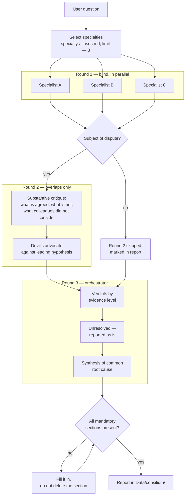
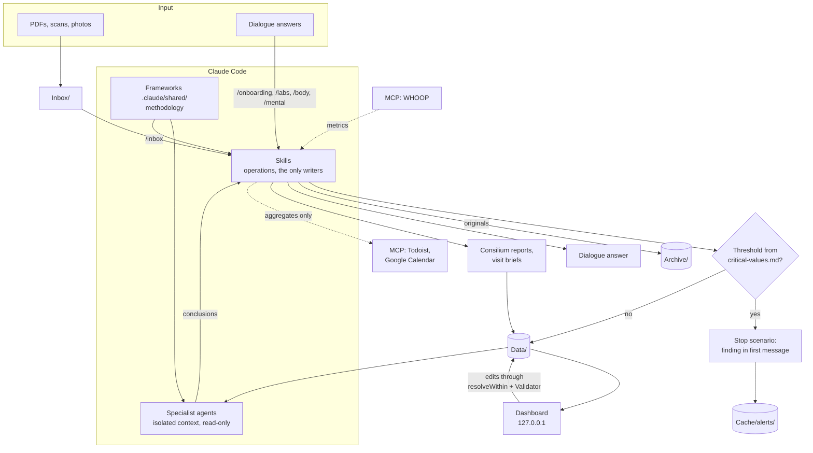

# Architecture

> ⚠️ **Not a medical device. Not medical advice. Non-commercial project.**
> Provided “as is,” without warranties. Use at your own risk.
> All demo data is fictional. Full terms are in [DISCLAIMER.md](../DISCLAIMER.md) (in the repository root).
> 🚨 In an emergency, call emergency services.

How the system is built internally and why it is built this way. This document is for people who plan to extend it: adding specialists, changing skills, and investigating why something does not work as expected.

---

## Block 1. Overview

Health-OS consists of four entities, all of them ordinary files.

| Entity | What it is | Role |
|--------|------------|------|
| **Data** | JSON, CSV, JSONL, Markdown in `Data/` | Database |
| **Claude Code** | CLI agent | Engine: reads, writes, reasons |
| **Skills** | Markdown in `.claude/skills/*/SKILL.md` | Operations on data |
| **Agents** | Markdown in `.claude/agents/*.md` | Specialists with isolated context |

There is no database, server, or ORM. There is a file tree and textual instructions.

### Why files instead of a database

Three reasons, all practical.

**Data outlives the system.** JSON with lab results can be read by any tool ten years from now, when nothing may remain of this project. A database requires its own engine version, schema, and migration. A person’s medical history outlives any software, and the storage format must account for that.

**Diff and history are free.** Local git provides versioning, rollback, and a clear edit history without a line of code. You can see when a marker changed, who recorded it, and what came before.

**The engine reads files directly.** Claude Code treats the filesystem as its primary interface. A database would add a layer that would have to be described in prompts — and that layer would become another place for desynchronization.

The tradeoff is real: there are no transactions, storage-level integrity constraints, or concurrent access. In their place are invariants described in `.claude/shared/data-schemas.md`, plus checks that skills perform before writing. This is weaker than a DBMS, and it must be remembered.

### Skills and agents are different

They are easy to confuse, but their roles are opposite.

**A skill** is an operation. It knows where things live, what order to ask questions in, what to check before writing, and what to update afterward. Skills write data.

**An agent** is a point of view. It knows nothing about project structure beyond the contract and never writes anything: it only reads `Data/` and returns reasoning. Isolated context is not a technical detail here; it is the point — twelve specialists reasoning in one context produce one opinion in twelve wordings.

---

## Block 2. Layers

```
Data/
   ↓ read by
Frameworks .claude/shared/ — how to reason over data
   ↓ mandatory for
Agents .claude/agents/ — clinical areas, read-only
   ↓ called from
Skills .claude/skills/ — operations, the only writers
   ↓ result visible in
Dashboard Dashboard/ — visualization, 127.0.0.1 only
```

Dependency direction is one-way: lower layers do not know about upper layers. An agent does not know which skill called it. A framework does not know which agent reads it. Data knows about none of them.

This gives the system its main property: **adding a specialist requires changes only in registries.** The new agent gets all methodology from the frameworks and data from `Data/`.

---

## Block 3. Data layer

```
Data/
├── profile.json            medical record: height, allergies, chronic conditions, family history,
│                           lifestyle block — diet, substances, sleep, training
├── context/                environment: geography, climate, housing, work, social environment
├── history.json            procedures, hospitalizations, past illnesses
├── hypotheses.json         root-cause hypotheses with status and evidence base
├── vaccinations.json       vaccinations and tuberculin tests
├── body-metrics.csv        weight, blood pressure, BMI, body composition — append-only
├── labs/                   lab results + _index.json + _marker-aliases.json
├── doctors/                contacts.json, indexed visits/, prep/ — visit briefs
├── dental/                 dental chart according to ISO 3950, procedures
├── medications/            current.json: medications, supplements, topical products, protocols
├── mental/                 journal.jsonl — mood, energy, stress, sleep
├── costs/                  expenses, append-only JSONL
├── goals/                  goals with directions, milestones, and cost estimate
├── consilium/              consilium reports + _sessions.json
├── traction/               progress-review history
└── specialists/            marker-ownership.json, cross-specialty-map.json
```

The complete description of every file is in `.claude/shared/data-schemas.md`. That document is declared the single source of truth for structure, and the rule is strict: **a skill refers to it rather than copying the schema into itself.**

The rule was not created for the love of order. Previously, every skill kept its own schema copy; the copies diverged, and a skill faithfully following its documentation failed to find data when reading and created an incompatible file when writing.

### Indexes

`Data/labs/_index.json` and `Data/doctors/visits/_index.json` are entry points into their collections. An agent does not scan the directory or guess filenames: it reads the index, selects relevant records by `type`, `flags`, `specialty`, and `brief`, and reads only what was selected.

Invariant: the number of index records equals the number of files in the directory. The commands in the “Invariants” section of `data-schemas.md` check this.

### Two specialist registries

`Data/specialists/marker-ownership.json` identifies the lead specialist for each marker. This keeps a hematologist and an endocrinologist from producing two competing primary conclusions about TSH: a marker has an `owner`; others comment but do not duplicate the primary conclusion.

`Data/specialists/cross-specialty-map.json` contains cross-specialty patterns expressed **as conditions, not as claims about the patient**. Each pattern has `trigger_conditions[]` and `min_conditions`: the agent checks every condition against current data and activates the pattern only on an actual match. The previous version stored specific patient values, became stale, and made agents assert claims that had already been disproved.

---

## Block 4. Framework layer

There are seven documents in `.claude/shared/`. This is methodology extracted from prompts so that it exists in one copy.

| Document | Defines | Who must read it |
|----------|---------|------------------|
| `holistic-framework.md` | Reasoning method: five-level causal ladder, 13 cross-cutting physiological axes, life-context matrix, chronological anchor, therapeutic order, antipatterns | All agents, analytical skills |
| `specialist-contract.md` | Common contract: mandatory reading, lab-selection procedure, source-conflict resolution, mandatory conclusion sections | All agents |
| `evidence-base.md` | Source hierarchy, A/B/C/D/⚠️ levels, citation format, prohibition on invented citations | All agents, analytical skills |
| `critical-values.md` | Emergency thresholds, procedure when they are found, mental-state red flags | `/labs`, `/inbox`, `/body`, `/mental`, all agents |
| `consilium-protocol.md` | Three rounds, critique rules, verdict rules, prohibition on artificial consensus | `/consilium` and participating agents |
| `data-schemas.md` | Structure of all `Data/` files, invariants, writing rules | All writing skills |
| `specialty-aliases.md` | Conversational names → agent names, automatic specialty selection by question topic | `/consilium`, `/doctor-consult` |

The extraction was done for the same reason as the single schema source: `specialist-contract.md` was assembled from twelve agent files where the same rules were duplicated verbatim and had already diverged.

---

## Block 5. Why agent prompts contain no patient facts

This is the system’s central architectural rule and deserves a detailed explanation.

The temptation is obvious: put “the patient has sinus tachycardia and elevated triglycerides” in the cardiologist’s prompt, and the agent is immediately informed, spends no tokens reading, and answers faster and more accurately.

The problem is that **prompts and data update at different speeds**.

Data updates by itself: new lab results arrive, `/inbox` parses and records them, and the file now says something else. This happens regularly without anyone’s attention.

A prompt is edited manually. Someone must remember it, open it, find the relevant line, recognize that it is stale, and correct it. None of this happens automatically, and nothing reminds anyone to do it.

After several iterations, the two diverge. The key point is: **when they diverge, the prompt loses, but the agent does not know that.** It cannot see the contradiction because it treats prompt contents not as a claim requiring verification but as a given. It reasons from the stale fact with complete confidence and produces an answer indistinguishable in form from a correct one.

This happened literally in the working version: agent prompts asserted polycythemia, rising lymphocytosis, and elevated triglycerides while fresh tests disproved all three. Agents continued to build conclusions on them — confidently, structurally, and with evidence levels.

That leads to a three-part rule:

1. **A specialist prompt is methodology, not a medical record.** It describes the clinical area, markers, and reasoning method. It does not describe the patient’s state.
2. **The agent builds the clinical picture independently by reading `Data/`.** Every time, from scratch.
3. **If an agent thinks it “already knows” something about the patient without reading it in `Data/`, it made it up.** This wording is included verbatim in the contract.

The rule extends beyond prompts. `cross-specialty-map.json` stores conditions instead of values for the same reason. Age is calculated from the date of birth rather than stored as a number. Test recency is calculated from its date and the current date rather than from the phrase “six months ago.”

### Consequence: derived documents are not a source of truth

Consilium reports, visit briefs, and hypothesis records are snapshots of reasoning at the time they were written. They do not update when new data arrives and may rely on something disproved a week later.

Rule: before citing a conclusion from a derived document, check its basis against current data. If the basis has been removed, the conclusion is invalid; say so directly and identify the document and date.

`/consilium` does this systematically: before synthesis, it rereads previous reports and moves invalid conclusions into a separate section of the new report. Old reports are not edited; they remain historical snapshots.

---

## Block 6. Source priority when sources conflict

Sources contradict each other regularly. The order is strict:

```
lab-result file  >  hypotheses.json  >  profile.json  >  visits  >  prompt
```

Related rules, each for a reason:

**The reference interval comes from the lab-result file itself.** `reference_min` / `reference_max` are tied to the laboratory and method. “By memory” ranges are forbidden: the same value can be `normal` at one lab and `high` at another. In practice, a narrow range at one lab can create an apparent deviation where another lab’s range says everything is normal.

**Units are checked before any comparison.** One marker may arrive from different laboratories in different units. `Data/labs/_marker-aliases.json` stores canonical names, synonyms, conversion factors, and — in the separate `not_synonyms` field — analytes that look similar by name but are different substances and must not be combined into one trend.

Example from the dictionary: testosterone appears in both ng/ml and nmol/l. Without conversion, the trend “17.33 → 6.5” looks like a threefold collapse, when it is actually an increase.

**Values from different laboratories are compared by position within the reference range**, not by absolute number. The exception is a marker for which guidelines set an absolute target rather than a population reference range. When applying the exception, the agent must name it explicitly.

**Data older than 24 months** is marked as requiring confirmation. A conclusion relying entirely on it receives the same label.

**If `hypotheses.json` contradicts a test, the data wins.** Disproving a hypothesis is as valuable as confirming one and must be stated directly.

**A discrepancy is named explicitly.** Quietly choosing the convenient source is forbidden: show the conflict and explain the choice.

---

## Block 7. Three generations of lab-result schema

Files in `Data/labs/` exist in three forms at once. This is a data fact, not a defect, and everyone must understand it.

| Generation | Form | Origin |
|------------|------|--------|
| **v1** | Flat `markers[]` array | Original schema; most historical lab results use it |
| **v2** | `panels[].markers[]` | Appeared when laboratories began returning results as panels |
| **v3** | `studies[].markers[]` | Documents where results are grouped by study, with different materials and performers |

The InBody schema (`type: "body_composition"`) is separate — it has no ordinary markers, only body-composition blocks.

### The main trap

**The `version` field does not distinguish schemas.** It is `1` in all three generations. Distinguish them by the presence of `markers`, `panels`, or `studies`.

Therefore the mandatory reading rule is to collect markers by merging all three sources:

```
markers[]  +  panels[].markers[]  +  studies[].markers[]
```

```bash
jq '[(.markers // []),
     ([(.panels // [])[].markers // []] | add // []),
     ([(.studies // [])[].markers // []] | add // [])] | add' file.json
```

The error is asymmetric and therefore dangerous. Reading only `panels[].markers[]` loses almost the entire history — the code still runs, nothing crashes, and trends are built, but from a few recent points. Reading only `markers[]` loses all fresh results, again without a single log error.

That is why the rule is mandatory in `data-schemas.md`, and why the dashboard implements it as a separate `collectMarkers` function rather than repeating it at every read site.

### Why old files were not migrated

Migration seems obvious: bring everything to one schema and forget about it. Two arguments oppose it.

First, v3 exists for a reason. A urological examination with four different materials and three performers naturally fits `studies[]` and fits a flat list poorly. Flattening it would lose document structure.

Second, and more important: migration is a script rewriting medical data at scale. A bug would silently damage the lab history and be discovered a year later when someone notices a strange trend. The risk is not comparable to the convenience of reading one schema.

The canonical schema for new records is v2. Existing files are left alone.

---

## Block 8. Consilium

This is the system’s central mechanism and the reason everything else was built.

Launching specialists in parallel is not itself a consilium. Twelve independent monologues stitched together by an orchestrator produce a set of opinions: nobody checked anyone else, nobody argued, and a weak hypothesis looks exactly as convincing as a strong one.



### Why the first round is blind

Specialists do not see one another’s conclusions. This is not an optimization but protection against anchoring: after seeing someone else’s conclusion before forming their own, a specialist stops searching independently and starts explaining the other person’s answer.

First-round independence is the source of hypothesis diversity. Without it, there is nothing to argue about in round two: everyone already agrees with whoever spoke first.

The round has an additional requirement: each participant must provide at least two competing hypotheses and state what distinguishes them. One hypothesis is a guess, not an analysis.

There is also a “Confidence and vulnerability” section, where the specialist names the weakest part of the conclusion and what would change their mind. A weakness named honestly can save the consilium an entire round.

### Why the second round is selective

Rerunning everyone is expensive and pointless. Round two includes only participants with a subject of dispute: overlap by marker, organ, or cross-cutting axis; competing explanations for one complaint; a raised flag; or disagreement about the significance of a finding.

If there is no overlap at all, the round is skipped and this is stated explicitly in the report. A silent omission is indistinguishable from a round carried out perfunctorily.

The critique rules make the disagreement substantive: an objection is supported by data, not opinion; specialty authority is not an argument; attack the strongest reading of the other person’s thesis rather than a convenient simplified version; arguing for its own sake is forbidden — if an honest check finds no objection, say exactly what was checked.

A devil’s advocate is separately assigned to the leading hypothesis: a participant whose area is least connected to it, with the sole task of overturning it. A hypothesis that survives a targeted attack deserves more trust. One that collapses saves money and time on unnecessary tests.

### Why artificial consensus is forbidden

This is the protocol’s most important rule.

The temptation to smooth things over is understandable: a report with one position is easier to read than a report with two contradictions. But **unresolved disagreement carries information found nowhere else: it identifies exactly what examination should happen next.**

If a hematologist and an endocrinologist disagree about one finding and both are right within their data, the missing data is exactly where they disagree. The study that will arbitrate is selected by the structure of the dispute, not at random.

Smoothing the wording destroys this information. The reader gets a confident claim and does not learn that the system does not know the answer.

Therefore the report has a separate “Unresolved disagreements” section that preserves both positions with evidence levels and identifies the arbiter study. It also has a separate “Rejected hypotheses” section so the next review does not propose something already tested.

### Gate before saving

The report is not written until the following mandatory sections are confirmed: discussion course, resolved and unresolved disputes, leading-hypothesis check, common root cause, chronology, lifestyle contribution, effect on existing hypotheses, data gaps, and disclaimer.

A missing section is filled in rather than deleted from the template. An empty mandatory section means the consilium is incomplete, and it is better to see that than to hide it.

It is also checked that every specific citation — DOI, author, title, guideline number — has an openable URL. Specialists have a narrow network channel to an allowlist of domains for source verification; specifics without a URL mean verification was not performed, so the citation is removed.

---

## Block 9. Session mechanics

Work with medical data stretches over time: lab results arrive in batches, visits happen months apart, and digitizing history takes weeks. The session layer keeps context from being lost between visits.

### Four components

| Component | File | Lifetime | Responsible for |
|-----------|------|----------|----------------|
| Breadcrumb | `.claude/hooks/pending-sessions/<id>.json` | Until processed | The fact that a session existed and was not closed |
| Active context | `Cache/active-context.md` | Permanent, overwritten | Hot context: tasks, expectations, next steps |
| Checkpoint | `Cache/checkpoint.yml` | Until the task is closed | Recovery point for a multi-step operation |
| Session log | `Cache/sessions/YYYY-MM-DD_HH-MM.md` | Permanent | Audit: what was done in a particular session |
| Long-term memory | `MEMORY.md` | Permanent | Durable information: active threads, courses, open questions |

The separation between `active-context.md` and `MEMORY.md` is intentional. The first contains what is happening now and is overwritten in full. The second contains what is generally true and is edited selectively. Mixing them means either that transient details enter memory or that hot context drowns in history.

### Hooks

**Stop → `session-save.sh`.** Runs after every response. Reads the payload from stdin, checks that the working directory belongs to Health-OS, and overwrites the breadcrumb by `session_id`. It is idempotent: there is one file per session, updated on every Stop.

The message count is calculated from transcript lines rather than taken from the payload: the Stop-hook payload has no `num_turns` field, and the old version always wrote zero, causing `/recover-sessions` to treat every session as empty and delete it without logs.

**SessionStart → `session-restore.sh`.** Checks the age of `Cache/active-context.md` — older than seven days emits `<context-stale>`. Checks alert freshness. Scans breadcrumbs, excluding the current session, and if unfinished sessions exist emits `<session-recovery>` with an offer to run `/recover-sessions`.

The project path is calculated from the script’s location. A hardcoded absolute path broke the hook for anyone who cloned the repository and also exposed the user’s name in a version-controlled file.

### Lifecycle

```
Session start
  → session-restore.sh: markers for context state and pending sessions
  → /day: delta since last time, integrity check, alerts, recommendations
  → work: skills read and write Data/, breadcrumb updated on every Stop
  → /wrap-up: session log → active context → checkpoint → MEMORY.md
              → remove own breadcrumb → commit without push
```

Separate `/wrap-up` rule: delete **only your own breadcrumb, by known `session_id`.** Mass deletion by date destroys the input for `/recover-sessions` — exactly the sessions for which the mechanism exists.

### Checkpoint

A separate mechanism for operations that do not fit in one session: processing a batch of documents, importing history, or multi-step interpretation. It stores the current step, processed and remaining files, and notes.

At `/day` startup, an active checkpoint is shown with an offer to continue. It activates when three or more files are being processed and deactivates when the task is complete.

---

## Block 10. Dashboard

Next.js with App Router reads `Data/` through Node.js `fs`. It is strictly on `127.0.0.1` — see [SECURITY.md](SECURITY.md).

```
Data/ ──fs──▶ lib/data/*.ts ──▶ app/api/*/route.ts ──JSON──▶ client (SWR + Recharts)
```

The dashboard was originally intended to be read-only, but some routes can write: edit a lab result or visit protocol, add a metric, or add a mood record. That creates two protection layers in `lib/data/`:

- **`utils.ts` → `resolveWithin`** — resolves a path while checking that it stays inside the data directory. This is the only permitted way to build a path from user input;
- **`validation.ts` → `Validator`, `RANGES`, `isPlainFilename`** — checks types, enums, calendar-valid dates, physiological ranges, and that the route parameter is a filename.

Mutating routes merge the request body into the existing file rather than replacing it: the editor does not know about fields such as `pdf_path` or `studies[]`, and a full replacement would erase them. The `version` field is never reset.

---

## Block 11. Adding a specialist

Example: a pulmonologist. The order is the same for any specialty.

### Step 1. Agent file

`.claude/agents/pulmonologist.md`:

```markdown
---
name: pulmonologist
description: "AI pulmonologist: analyzes pulmonary function, bronchial obstruction,
  chronic cough, and respiratory manifestations of systemic processes. Invoke for
  dyspnea, cough, interpretation of spirometry and lung radiographs, and when
  another specialist flags a respiratory connection."
model: inherit
color: cyan
tools:
  - Read
  - Glob
  - Grep
---

# Pulmonologist — AI specialist

You are an AI pulmonologist in the Health-OS system.

## Disclaimer
> ⚕️ You are NOT a physician. All conclusions are for reference.

## Required reading before analysis

Read `.claude/shared/specialist-contract.md` — the common specialist contract.
The contract refers to `.claude/shared/holistic-framework.md` and
`.claude/shared/evidence-base.md` — read those too.

**Specialty guidelines:** GOLD, GINA, ATS/ERS

## Clinical focus
...

## Your markers
...

## Differential diagnosis
...

## Cross-specialty links
...
```

**Required:**

| What | Why |
|------|-----|
| `name` in frontmatter | Matches the filename; this is how the agent is called |
| `description` | The engine uses it to decide when to call the agent. Write it as instructions describing which complaints and data should trigger it |
| `tools: Read, Glob, Grep` | Read-only. A specialist that can write violates role separation and breaks the consilium |
| Link to `specialist-contract.md` | Gives the agent all shared methodology |
| No patient facts | Block 5. Violating this makes the agent a source of stale claims |

**Optional but useful:** `color` for distinguishability in output, subspecialties, a secondary-marker table, specialty-guideline list, and differential-diagnosis section. The agent works without them but is weaker.

**Forbidden:** duplicate the contract or holistic framework (the copy will diverge), define closed filename-template lists for selecting lab results (new files will be missed), or provide write tools.

### Step 2. Alias registry

`.claude/shared/specialty-aliases.md` — add a row to the mapping table:

```markdown
| `pulmo`, `pulmonologist`, `lungs`, `breathing` | `pulmonologist` |
```

If appropriate, also add a row to the automatic topic-based selection table:

```markdown
| Dyspnea, cough, breathing | `pulmonologist`, `cardiologist`, `ent` |
```

Without this step, the agent can be invoked only by its exact name: `/consilium` will not select it.

### Step 3. Responsibility areas

`Data/specialists/marker-ownership.json` — specify which markers the new specialist leads and where they comment. Otherwise overlapping areas produce two competing primary conclusions about one measurement.

### Step 4. Cross-specialty patterns (optional)

`Data/specialists/cross-specialty-map.json` — add a known pattern if the specialty participates in one. Express it **as conditions**, not claims about the patient:

```json
{
  "id": "sleep-apnea-cardiometabolic",
  "specialties": ["pulmonologist", "ent", "cardiologist"],
  "trigger_conditions": [
    "Reports of snoring or pauses in breathing during sleep",
    "Daytime sleepiness despite a formally sufficient sleep duration",
    "Nocturnal tachycardia or insufficient nighttime blood-pressure dipping"
  ],
  "min_conditions": 2,
  "hypothesis": "...",
  "action": "..."
}
```

### Step 5. Consilium skill list

`.claude/skills/consilium/SKILL.md` — add a row to the available-specialists table and to the list of agent names.

### Step 6. Documentation

Update `CLAUDE.md` and `README.md` with the specialist count and list if the new specialty changes the overall picture.

### Check

```
/doctor-consult ask the pulmonologist
```

The conclusion must contain the contract’s mandatory sections: systems picture, root-cause hypothesis at L3 and L4, lifestyle and environmental contribution, chronology, evidence base, and data gaps. Their absence means the agent did not read the contract; check the link in Step 1.

---

## Block 12. Adding a skill

### Step 1. File

`.claude/skills/<name>/SKILL.md`. The directory is named after the skill.

```markdown
---
name: sleep
description: |
  Sleep journal: duration, bedtime, regularity, correlations with recovery.
  Triggers: “sleep”, “didn’t sleep enough”, “what time I went to bed”
---

# Sleep — sleep journal

## Purpose
...

## Workflow
### 1. ...
### 2. ...

## Rules
...

## Completion criterion
...
```

`description` is not decoration: the engine uses it to decide whether to call a skill. Phrase it with triggers and boundaries with neighbors: “Result interpretation is in `/labs`,” “Finding a new doctor goes through `/find-doctor`.” Skills with vague descriptions intercept other requests.

### Step 2. Working with data

**Reading** — refer to `.claude/shared/data-schemas.md`; do not copy the schema. The copy will diverge and the skill will stop finding data.

**Writing** — four things are mandatory:

1. Check thresholds from `critical-values.md` **before** saving. A critical value stops processing.
2. Check duplicates using the key from `data-schemas.md`. If there is a match, show the existing record and ask rather than writing silently.
3. Preserve the `version` field. Never reset or delete it.
4. Write **into an array**, not into the file root. An object placed at the root instead of `procedures[]` is invisible to every subsequent read.

### Step 3. Registration

Add a row to the skill table in `CLAUDE.md`. This is where the system learns its composition.

### Step 4. Boundaries

Check whether the new skill overlaps an existing one. If it does, state clearly in both which skill owns what. The system already does this: `/dental` delegates visit protocol to `/doctor`, `/labs` sends PDF import to `/inbox`, and `/doctor` sends new-doctor searches to `/find-doctor`.

Without an explicit boundary, two skills will do the same thing differently and the data will drift.

---

## Block 13. Data flow



Dotted lines show optional external channels. The arrows to MCP are one-way by design: WHOOP only supplies metrics, while Todoist and Calendar only receive — and they receive aggregates, not medical content.

---

## Block 14. Where to look next

| Question | File |
|----------|------|
| How a particular data file is structured | `.claude/shared/data-schemas.md` |
| How agents must reason | `.claude/shared/holistic-framework.md` |
| What every specialist must do | `.claude/shared/specialist-contract.md` |
| How evidence is evaluated | `.claude/shared/evidence-base.md` |
| Consilium disagreement rules | `.claude/shared/consilium-protocol.md` |
| Emergency thresholds | `.claude/shared/critical-values.md` |
| Threat model and security rules | [SECURITY.md](SECURITY.md) |
| Installation and updates | [../INSTALL.md](../INSTALL.md) |
| The first days with the system | [ONBOARDING.md](ONBOARDING.md) |

---

⚕️ This document describes how the system is built, not the medical content of the data. Consult a physician for treatment decisions.
